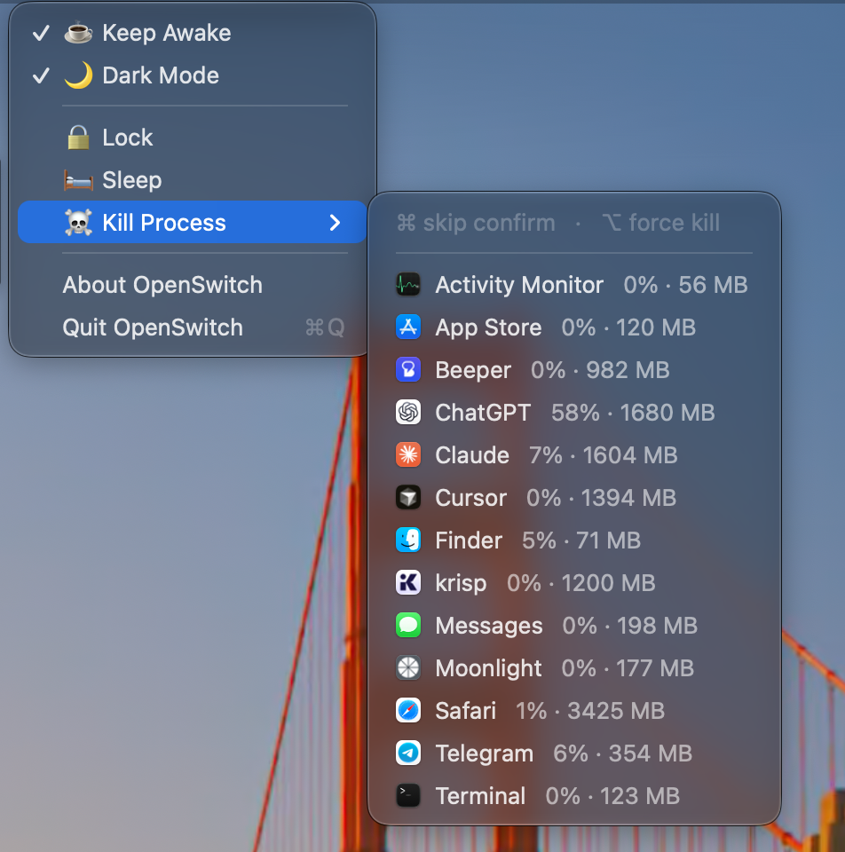

# OpenSwitch

**Simple switches to do simple things.**

<p align="center">
  
</p>

A tiny native macOS menu bar app that puts the everyday actions you actually reach for one click away.

- **Keep Awake** — off on first run. When on, your display and system won't sleep (via an IOKit power assertion). The state persists across app restarts.
- **Dark Mode** — reflects the current system appearance; toggles the system-wide Light/Dark setting.
- **Audio** — a submenu to switch the default **Output**, **Input**, and **Alerts** (sound-effects) device without opening System Settings. Each lists the available devices with the current default checked; click one to switch.
- **Lock** — a momentary action that locks the screen immediately (shows the password prompt).
- **Sleep** — a momentary action that puts the computer to sleep immediately.
- **Kill Process** — a submenu of your running foreground apps (the ⌘-Tab list; helper and system processes are excluded), each showing approximate CPU% and memory aggregated across the whole app (main process plus its helper/XPC children, like Activity Monitor). Click one to terminate it after a confirmation. Modifiers: **⌘-click** skips the confirmation, **⌥-click** sends `SIGKILL` (force) instead of `SIGTERM` — combine them (⌘⌥) to force-kill with no prompt.
- **Clipboard** — a submenu of your recent copies (text and images, e.g. screenshots or images copied from a browser). Click one to copy it again, then paste with ⌘V. History is kept in memory only (never written to disk) and capped at the last 20 items; passwords and other copies marked sensitive are skipped. Includes a **Clear History** action.

Lives entirely in the menu bar — no Dock icon, no window.

## Why I built it

I was paying for subscriptions and $20-plus one-off apps that each did *some* of these things — one to keep the Mac awake, another to lock or sleep it, another to force-quit apps. It added up, and none of them did everything.

There's no reason the handful of actions I want most should cost that much or live in five separate menu bar icons. So I put them in one small, free, no-nonsense app. That's how OpenSwitch was born.

## Requirements

- macOS 13 or later
- Swift toolchain (Xcode or Command Line Tools — `xcode-select --install`)

## Build & run

```sh
./build.sh          # builds and assembles OpenSwitch.app
open ./OpenSwitch.app
```

`build.sh` runs `swift build -c release`, bundles the binary into `OpenSwitch.app` with its `Info.plist`, and ad-hoc code-signs it (a stable identity so macOS remembers the Automation permission across rebuilds).

To quit: use **Quit OpenSwitch** in the menu, or `pkill -f OpenSwitch`.

## Permissions

Toggling **Dark Mode** scripts System Events, so the first time you use it macOS will ask for **Automation** permission — approve it once. **Keep Awake** and **Sleep** need no special permissions.

## How it works

| Feature | Mechanism |
| --- | --- |
| Keep Awake | `IOPMAssertionCreateWithName` with `kIOPMAssertionTypePreventUserIdleDisplaySleep` |
| Dark Mode | AppleScript → System Events `appearance preferences` |
| Audio | Core Audio `kAudioHardwarePropertyDevices` to list; `kAudioHardwarePropertyDefault{Output,Input,SystemOutput}Device` to read/switch |
| Lock | `SACLockScreenImmediate` from the private `login` framework (via `dlopen`) |
| Sleep | `pmset sleepnow` |
| Kill Process | `NSWorkspace.runningApplications` (regular apps only) to list; `ps -axo %cpu=,rss=` summed per app via `responsibility_get_pid_responsible_for_pid` grouping; `kill(pid, SIGTERM/SIGKILL)` to terminate |
| Clipboard | Polls `NSPasteboard.general.changeCount`; captures text and images (`NSImage(pasteboard:)`), skipping `org.nspasteboard.ConcealedType`/`TransientType` |

Built with AppKit (`NSStatusItem` + `NSMenu`) and Swift Package Manager. No third-party dependencies.

## Contributing

Contributions are welcome — see [CONTRIBUTING.md](CONTRIBUTING.md).

## License

MIT — see [LICENSE](LICENSE).
